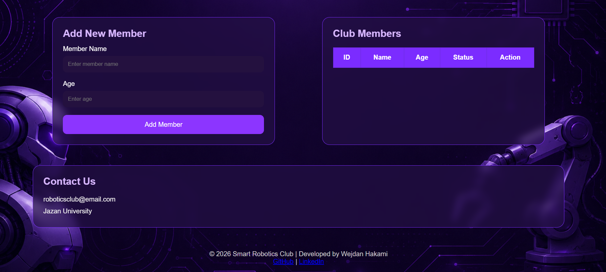
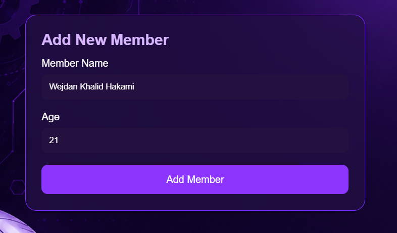
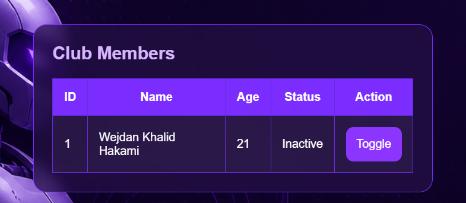
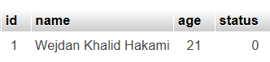
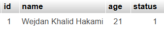

# Robotics Club Management

A simple web application for managing robotics club members using PHP and MySQL.

The application allows users to add new members, store their information in a MySQL database, display all members in a table, and update each member's status (Active / Inactive) instantly without reloading the page.

---

## Live Demo

🌐 https://smartrobotics.wuaze.com/

---

## Features

- Add new robotics club members
- Store member information in a MySQL database
- Display members in a table
- Toggle member status (Active / Inactive)
- Update member status instantly without refreshing the page
- Simple and clean user interface

---

## Technologies Used

- HTML5
- CSS3
- JavaScript
- Fetch API
- PHP
- MySQL
- InfinityFree Hosting

---

## Project Structure

```
robotics-club-management/
│
├── index.php
├── db.php
├── toggle.php
├── script.js
├── style.css
├── background.png
├── README.md
└── images/
    ├── home-page.png
    ├── add-member.png
    ├── members-table.png
    ├── database-before-toggle.png
    ├── table-after-toggle.png
    └── database-after-toggle.png
```

---

## How It Works

1. Open the web application.
2. Enter the member name and age.
3. Click the **Submit** button.
4. The member information is stored in the MySQL database.
5. The members table is updated automatically.
6. Click the **Toggle** button to change the member status.
7. The status updates instantly without reloading the page.

---

## Database Structure

Table: **members**

| Column | Description |
|---------|-------------|
| id | Member ID |
| name | Member Name |
| age | Member Age |
| status | Member Status |

---

## Screenshots

### Home Page

The main interface of the application.

 


---

### Add Member

Adding a new member through the input form.



---

### Members Table

Displaying the members after adding a new record.



---

### Database Before Toggle

The member status before clicking the **Toggle** button.



---

### Table After Toggle

The member status changes instantly without refreshing the page.


---

### Database After Toggle

The updated status is saved successfully in the MySQL database.



---

## Learning Outcomes

Through this project, I practiced:

- Connecting PHP with MySQL
- Working with databases (Insert, Select, and Update)
- Handling HTML forms using PHP
- Updating data dynamically using JavaScript Fetch API
- Building a complete web application
- Deploying a PHP project using InfinityFree Hosting

---

## Author

**Wejdan Hakami**

GitHub: https://github.com/wejdan-h

LinkedIn: https://www.linkedin.com/in/wejdan-hakami-28774940b/
